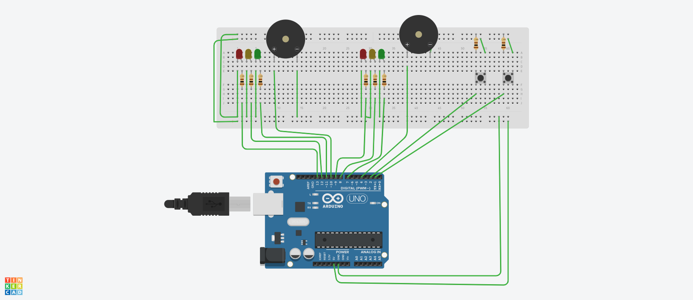

# Task-8: Traffic-Light-Control-System

## Aim

Design and development of an embedded systems application for simulating traffic light control system at a crossroad using Arduino microcontrollers and corresponding hardware components as part of Embedded Systems Lab Training SS2022.

## Design Approach

The  design consists of two traffic lights one for each direction of the crossroad (Horizontal and Vertical). Each traffic will have three indicator lights and will be implemented using LEDs (Green, Yellow, Red). The system works in the following way:

1. When the system starts, one traffic light will be green initially.
2. Cars will randomly approach either side and will be simulated using queues coded in the controller.
3. After a preset amount of time expires the traffic lights will switch.
4. The traffic simulated using the queue for the corresponding light which is green is processed until a preset time.
5. After this preset time the traffic light switches again and the cycle is repeated.
6. Two buttons will be provided in system to simulate pedestrians and when the the buttons are pressed ......(to be filled)
7. Preset time will be aloted to the pedestrians to cross the road and will be signaled using a beeper.  

## Components Required

| Component                     | Quantity      |
| :-----------------------------|   :---:       |
| `LED Red`                     | 2             |
| `LED Green`                   | 2             |
| `LED Yellow`                  | 2             |
| `Push button`                 | 2             |
| `Resistors 50ohm to 150 ohm`  | 8             |
| `ARduino UNO`                 | 1             |
| `Buzzer`                      | 1             |

## Circuit Diagram

 

