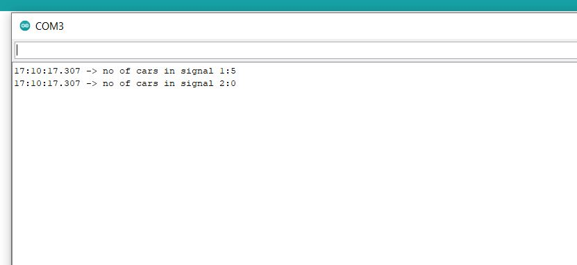

# Task-8: Traffic-Light-Control-System

## Aim

Design and development of an embedded systems application for simulating traffic light control system at a crossroad using Arduino microcontrollers and corresponding hardware components as part of Embedded Systems Lab Training SS2022.

## Design Approach

The  design consists of two traffic lights one for each direction of the crossroad (Horizontal and Vertical). Each traffic will have three indicator lights and will be implemented using LEDs (Green, Yellow, Red). The system works in the following way:

1. Initially when the system starts, one traffic light will be green and the other will be red and both pedestrian lights will be red.
2. After a preset amount of time expires the both traffic lights will become yellow for a very short time before switching and the light which was green will be red      and viceversa.
3. After the preset time expires the traffic light switches again and the cycle is repeated.
4. Two buttons will be provided in system to simulate pedestrians, if the button is pushed the above traffic cycle is interrupted and traffic light corresponding to      the road which cuts the pedestrians path is turned red for a preset time so the pedestrians can pass, The traffic light for pedestrians will be green indicating        the same.
5. Preset time will be alloted to the pedestrians to cross the road and will be signaled using a beeper and green signal as the pedestrians light and when time expires    the pedestrian light will be red. 
6. Cars will randomly approach either side of the road and will be simulated using queues coded in the controller.
7. The traffic simulated using the queue for the corresponding light which is green is processed until a preset time. 

## Components Required

| Component                     | Quantity      |
| :-----------------------------|   :---:       |
| `LED Red`                     | 4             |
| `LED Green`                   | 4             |
| `LED Yellow`                  | 2             |
| `Push button`                 | 2             |
| `Resistors 100 ohm`           | 12            |
| `ARduino UNO R3`              | 1             |
| `Buzzer`                      | 2             |
| `Connecting Wires`            |               |
| `BreadBoard`                  | 1             |

## Circuit Diagram

## Implementation

### Demo video for Traffic Control System

https://user-images.githubusercontent.com/104303685/168683602-431e8adc-cb27-4393-8422-d93f9e89fcbd.mp4

### Implementation of Queues

Initially both the signals are red  and pedestrians signals are also red and both queues are empty

Then one traffic signal (signal 1) is red and the other traffic signal (signal 2) is green. Since signal 1 is red we push a preset number of vehicles (in this case 5) to the queue and since signal 2 has an empty queue we dont have any vehicles to pop so the queue for signal 2 is zero, both pedestriant signals are red.

After this scenario both the traffic signals turn yellow for a very brief time and then the signals are exchanged from the previous scenario signal 1 is green and signal 2 is turned red hence the queues are also interchanged, 5 vehicles are poped from the queue of  in traffic signal 1 and 5 are added to traffic signal 2. This cycle is repeated in turns with exchange of signals, both pedestriant signals are red.

When the pedestriants button is pushed the traffic signal corresponding to the road which cuts the pedestrians path is turned red (signal 2) and corresponding pedestriant light is green for a preset time so the pedestrians can pass and the other traffic signal (signal 1) is turned green and the corresponding pedestriant light is red. A preset amount of time (in this case its 3 sec) is provided to simulate pedestrianst crossing the road, mean while in signal 2 we push 3 more vehicles and we pop 3 vehicles from the signal 1 but in our particular scenario there is nothing to pop hence the queue value is zero. If both the pedestriants buttons are pushed then both the traffic lights are red and 3 vehicles are poped from both the queues.

---

 

